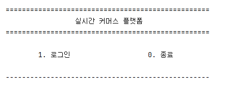
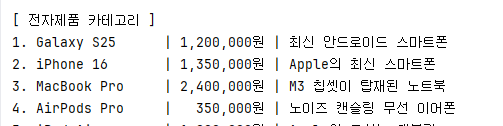
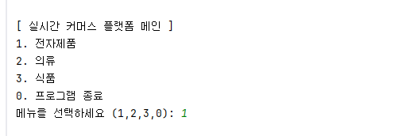
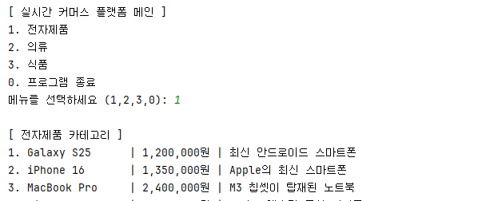
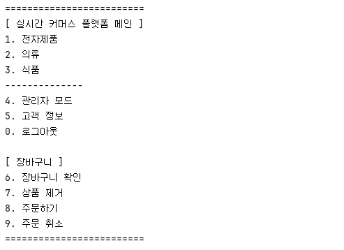
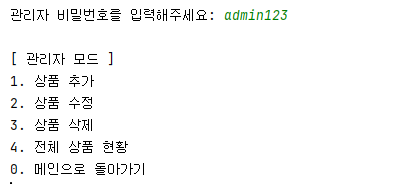
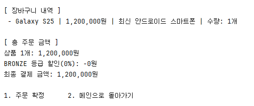
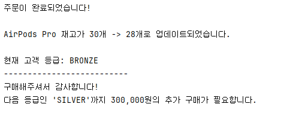
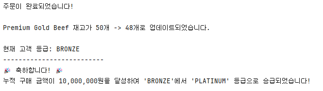
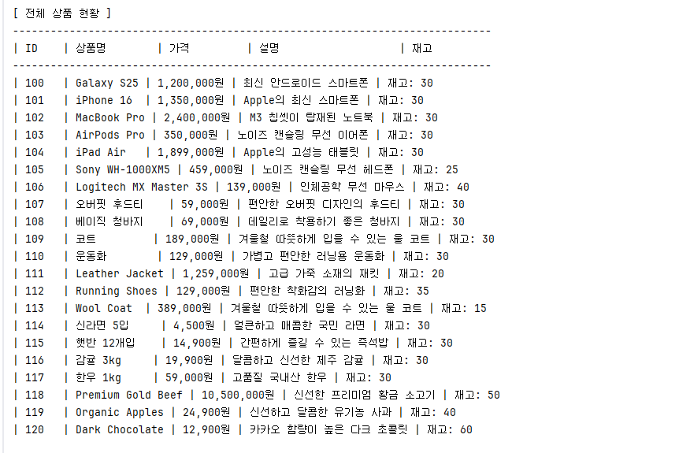

# 🛒 Commerce Platform

Java를 활용한 콘솔 기반의 커머스 플랫폼 구현!

평소 쿠팡, 네이버 쇼핑과 같은 커머스 서비스를 사용하면서 상품 조회부터 장바구니, 주문, 결제까지 여러 기능이 서로 연결되어 동작하는 구조를 바탕으로 구현했습니다.

단순한 상품 조회와 구매 기능에서 시작하여 상품 카테고리, 장바구니, 주문, 고객 등급 및 할인, 관리자 기능 등 실제 커머스 서비스에서 필요한 기능을 단계적으로 확장해 나갔습니다.




프로젝트 기록: https://velog.io/@juhan913/posts

---

## 📌 Project Goal

- Java 기본 문법을 활용한 커머스 프로그램 구현
- 객체별 역할과 책임을 분리하여 코드 구성
- 상품, 고객, 장바구니 등의 도메인 객체 설계
- `Enum`을 활용한 고객 등급 및 카테고리 관리
- `Lambda`와 `Stream`을 활용한 상품 조회 및 삭제
- 사용자 입력에 대한 예외 처리
- 관리자와 일반 사용자의 기능 분리


--------
## 🛍️ 과제 단계

### Level 1: 기본 상품 관리 시스템



### Level 2: 순서 제어를 클래스로 관리


### Level 3/4: 상품 카테고리 클래스 관리 + 캡슐화


### (도전 단계) Level 4: 장바구니 시스템


### (도전 단계) Level 5: 관리자 모드 추가


### (도전 단계) Level 6: Enum,람다,스트림을 활용 기능


-------------

----------------

### 추가 기능: 등급 업그레이드 시스템

고객의 누적 구매 금액을 기준으로 고객 등급이 자동으로 승급되는 기능을 추가해봤습니다!

| 고객 등급 | 누적 구매 금액 | 할인율 |
| --- | ---: | ---: |
| BRONZE | 0원 | 0% |
| SILVER | 1,000,000원 이상 | 5% |
| GOLD | 5,000,000원 이상 | 10% |
| PLATINUM | 10,000,000원 이상 | 15% |

주문이 완료되면 해당 주문의 할인전 결제 금액을 고객의 누적 구매 금액에 추가하고, 변경된 누적 구매 금액을 기준으로 등급을 확인합니다.

```java
totalSpend += totalCostOfOrder;
//누적 구매 금액 + 주문 할인전 결제 금액

// 현재 등급이: BRONZE   누적 금액: 300,000원
// 1,000,000원 상품 구매 -> 누적 금액: 1,300,000원
// 'BRONZE'에서 'SILVER'로 승급
 ```

#### 예시 1:


#### 예시 2:


--------------

----------
###  상품 카테고리

- 전자제품
- 의류
- 식품


-> 상품 조회

사용자가 원하는 카테고리를 선택하여 상품을 조회할 수 있습니다.



```text
[ 전자제품 카테고리 ]

1. Galaxy S25      | 1,200,000원 | 최신 안드로이드 스마트폰
2. iPhone 16       | 1,350,000원 | Apple의 최신 스마트폰
3. MacBook Pro     | 2,400,000원 | M3 칩셋이 탑재된 노트북
4. AirPods Pro     |   350,000원 | 노이즈 캔슬링 무선 이어폰
0. 뒤로가기